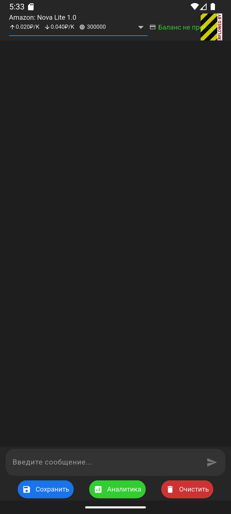

# AIChatFlutter - Чат-приложение с ИИ

AIChatFlutter - это мультиплатформенное приложение для общения с искусственным интеллектом, разработанное с использованием Flutter. Приложение поддерживает работу как с OpenRouter.ai, так и с VseGPT.ru, предоставляя гибкие возможности для взаимодействия с различными языковыми моделями.

Данный вариант приложения доработан с использованием Cline. Добавлен экран авторизации. Оригинальный репозиторй - [neuro-fill/AIChatFlutter](https://github.com/neuro-fill/AIChatFlutter).  

Экран авторизации:
  
Главный экран:

